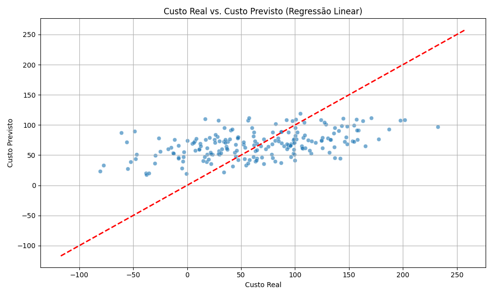

# Notebook de Análise de Custos em Nuvem com IA

Este notebook demonstra um pipeline simples de ingestão, processamento e análise de dados de custos em nuvem usando Machine Learning.

## 1. Geração de Dados Sintéticos

Geramos dados sintéticos para simular o uso de recursos (CPU, Memória, Transferência de Dados) e o custo total associado.

```python
# Código de geração de dados (ver script principal)
```

## 2. Pipeline de Ingestão e Processamento de Dados

Os dados são carregados e divididos em conjuntos de treino e teste para o treinamento do modelo.

```python
# Código de processamento de dados (ver script principal)
```

## 3. Modelo de Machine Learning

Utilizamos um modelo de Regressão Linear para prever o custo total com base no uso dos recursos.

```python
# Código de treinamento do modelo (ver script principal)
```

## 4. Resultados e Visualização

Avaliamos o desempenho do modelo usando MSE e R-squared, e visualizamos a comparação entre custos reais e previstos.

```python
# Código de avaliação e visualização (ver script principal)
```

### Gráfico de Custo Real vs. Custo Previsto



### Dados Tratados e Resultados

Os dados tratados e os resultados da previsão estão disponíveis em `dados_custo_nuvem.csv` e `resultados_previsao_custo.csv`.
